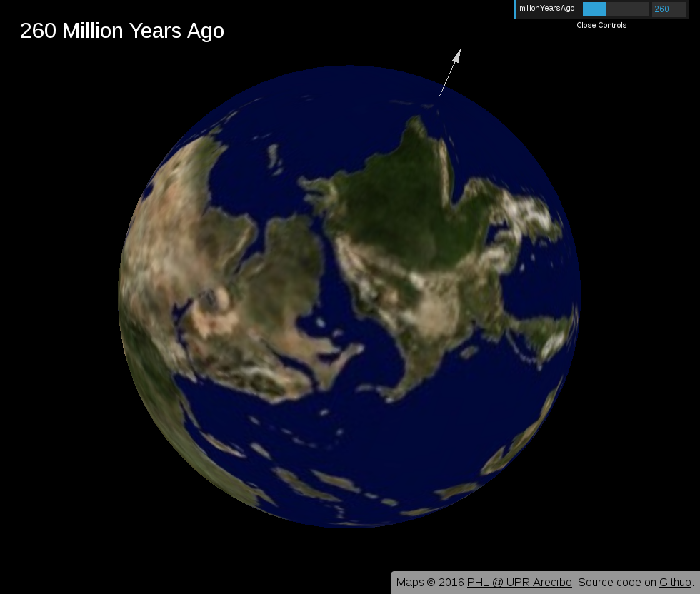

# Paleogeographic mapping on a globe

Demo at: https://rjw57.github.io/paleoglobe

This repository contains an experiment in representing paleogeographic maps on
an interactive globe.



## Sources and copyright

The map imagery comes from the [Visible Paleo-Earth
project](http://phl.upr.edu/projects/visual-paleo-earth/). See the
[SOURCES.txt](SOURCES.txt) file for more information.

The [LICENSE.txt](LICENSE.txt) file contains important information on the
licensing of imagery and code.

## Building

Use ``npm``:

```console
$ git clone https://github.com/rjw57/paleoglobe
[...]
$ cd paleoglobe
$ npm install
[...]
$ npm run build
```

## Developing

A development web-server with live reloading may be run via:

```console
$ npm run dev
```

